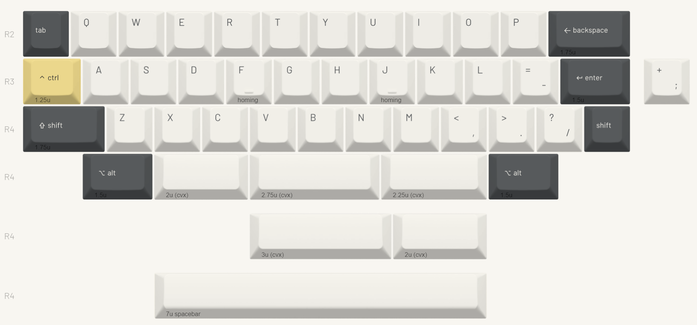

## 1. 本書について

本書は自作キーボードキットHenge40 DIYキットのビルドガイドです。

Henge40 DIYキットは、[Henge40](https://ymkn.booth.pm/items/6482393)の専用アルミケースを含まない、基板だけの構成です。付属のボトムプレートを使ってサンドイッチマウントスタイルで組み立てることも、ケースデータ等を参考にしてケースを自作し、そのケースに組み込んで使うこともできます。

本書ではボトムプレートを使ったサンドイッチマウントでの組み立てについて説明します。ケースデータを使って作った自作ケースに組み込む場合は、[Henge40のビルドガイド](https://github.com/ymkn/Henge40/blob/main/doc/buildguide.md)を参考にしてください。

## 2. 準備

### 2.1 内容物の確認

製品到着後すぐに内容物を確認し、不足や破損があった場合は保証期間内にお問い合わせください。

|番号|品目|数量|備考|
|----|----|----|----|
|1|Henge40 メイン基板|1枚||
|2|Henge40 ドーターボード|1個||
|3|Henge40 スイッチプレート|1枚||
|4|Henge40 スイッチパッド|1枚|メイン基板とスイッチの間に敷く|
|5|Henge40 ケースフォーム|1枚|ケースに組み込む場合にボトムケース側に敷く|
|6|Henge40 ボトムプレート|1枚|サンドイッチマウント構成で使用|
|7|FPCケーブル 150mm 8ピン 1mmピッチ|1本||
|8|Damping Ball シリコンゴム|4個|ケースに組み込む場合にガスケットマウント材として使用|
|9|M2ねじ(銀) 4mm|4個|Henge40ケース固定用|
|10|M2ねじ(黒) 4mm|4個|ドーターボード固定用|
|11|M2ナット|4個|ドーターボード固定用|
|12|M3ねじ(金) 5mm|4個|スイッチプレート固定用|
|13|M3ねじ(黒) 4mm|4個|ボトムプレート固定用|
|14|M3スペーサー 10mm|4個|サンドイッチマウント用|
|15|M3シリコンワッシャー 1mm|4個|スペーサーとスイッチプレートの間に挟んで使用|

> [!NOTE]
> 本キットには、Henge40専用アルミケースおよびスイッチフォームは含まれておりません。

### 2.2 別途用意が必要な部品

下記は本キットに含まれません。国内外の自作キーボード専門店や電子部品販売店などから別途調達してください。

|品目|数量|備考|
|---|---|---|
|MX互換キースイッチ|39-41|Cherry MXもしくはその互換品|
|MX互換キーキャップ|必要数|Cherry MXもしくはその互換品|
|2uサイズPCBマウント型スタビライザー|2-3|最下段で2u/2.75uキーを使う場合に必要です|
|3uサイズPCBマウント型スタビライザー|1|最下段で3uキーを使う場合に必要です|
|7uサイズPCBマウント型スタビライザー|1|最下段で7uキーを使う場合に必要です|
|ゴム足等の滑り止め|任意|ボトムプレートで組む場合など、お好みに応じて追加してください|

> [!NOTE]
> 必要なスタビライザーの数とサイズは、選択する最下段レイアウトによって変わります。利用するキーキャップ構成に合わせて用意してください。

### 2.3 適合するキーキャップサイズ

Henge40は40%キーボードのため、一般的なキーキャップセットには含まれないサイズがあります。購入前に必要なサイズが揃っているか確認してください。

|行|サイズ|初期レイアウトの対応キー名|
|---|---|---|
|R1|-|本キーボードにR1行はありません。最上段はR2行となります|
|R2|1u|Tabキー|
|R2|1.75u|Backspaceキー|
|R3|1.25u|Controlキー|
|R3|1.5u|Enterキー|
|R4|1.75u|Shiftキー|
|R4|1u|Shiftキー|
|R4|2u x 2, 2.75u, 3u, 7u|スペースキー。選択する最下段レイアウトにより異なります|

上に示したキー名はあくまで初期レイアウトのものです。キーマップはお好みに変更可能です。また、キーキャップの印字内容は動作に影響しないため、同じ行・同じサイズのキーキャップであれば異なる印字でもお使いいただけます。

また、Yuzu KeycapsにてHenge40専用デザインのキーキャップセットの[Henge40 Yozoraを10%引きで購入](https://yuzukeycaps.com/c/fd4c518a-8afc-438e-90b2-e3d33be1ccdc?aff=YMKN10)できます。

### 2.4 道具

以下の道具が必要です。

|品目|数量|備考|
|---|---|---|
|M2/M3ねじ用のプラス精密ドライバー|1|ネジ留めに用います。自作ケースを用いる場合は`軸径3mm以下の細いもの推奨|
|キースイッチ/キーキャッププラー|任意|スイッチやキーキャップを外す際にあると便利です|
|ピンセットまたはラジオペンチ|任意|曲がったスイッチピンを直す際にあると便利です|

## 3. 組み立て前の注意

組み立てを始める前に、基板ウラ面の部品の状態がわかるような写真を撮影しておくことをお勧めします。初期不良で問い合わせる際の説明に役立ちます。

> [!CAUTION]
> 基板上の部品やコネクタ類は強い力に弱いです。スイッチやネジを取り付ける際は、無理な力を加えないように注意してください。

> [!CAUTION]
> キースイッチを取り付ける際は、スイッチのピンが曲がっていないことを確認してください。ピンが曲がった状態で押し込むと、ソケットや基板上の部品を破損する原因になります。組立時の破損は保証対象外となります。

## 4. 組み立て手順

### 4.1 スタビライザーの取り付け

スタビライザーは基板のオモテ面に取り付けます。

取り付け位置はレイアウトによって異なります。メイン基板上のガイドを参照してください。

取り付け方はスタビライザーの説明書等を参照ください。一般には大きい穴の方にツメを引っかけ、小さい穴の方にプッシュピンを差し込む、もしくはネジ留めを行うものが多いです。

### 4.2 スイッチパッドの取り付け

基板のオモテ面にスイッチパッドを乗せます。スイッチパッドの穴とスイッチの設置箇所が合う向きにしてください。

スイッチパッドは打鍵音を小さくし、反響音を抑えるための部品です。取り付けは任意です。

### 4.3 スイッチとスイッチプレートの取り付け

スイッチパッドの上にスイッチプレートを乗せ、その上からキースイッチを基板のソケットに差し込みます。

差し込む前にスイッチの向きをよく確認してください。ほとんどのスイッチは南向き（ピンがキーボードの奥側向き）ですが、採用レイアウトによっては最下段に北向きの場所があります。

まず四隅のスイッチを取り付けて基板・スイッチパッド・スイッチプレートの位置を合わせ、その後に残りのスイッチを取り付けると作業しやすいです。

### 4.4 ドーターボードの取り付け

ボトムプレートのガイドにドーターボードを取り付けます。USBコネクタがプレートの外側に向くように乗せて、ボトムプレートのウラ面からM2ネジ（黒）を通し、ドーターボード側からM2ナットで固定します。

### 4.5 ボトムプレートの取り付け

ボトムプレート四隅の穴オモテ面側にスペーサーを乗せ、ウラ面からM3ネジ（黒）で取り付けます。

ドーターボードにFPCケーブルを取り付けます。ケーブルの青色の面を上にしてコネクタに差し込んで固定してください。

メイン基板側にも同様にFPCケーブルを取り付けますが、ケーブルが短いため、基板の自重などで引っ張られてコネクタに力がかからないように注意してください。

> [!CAUTION]
> コネクタは非常に壊れやすい繊細な部品です。細心の注意を払って扱ってください。コネクタの破損は修復が困難で、基本的にマイコンボードや基板ごとの交換が必要になるため、くれぐれも注意してください。

[Slab40のビルドガイド](https://github.com/ymkn/Slab40/blob/main/doc/buildguide.md)や[Henge40のビルドガイド](https://github.com/ymkn/Henge40/blob/main/doc/buildguide.md)で写真付きの説明があるので参考にしてください。

スペーサーの上にシリコンワッシャーを乗せ、その上にFPCケーブルを接続したメイン基板とスイッチプレートを、シリコンワッシャーの上からスペーサーに乗せます。スイッチプレートのオモテ面からM3ネジ（金）で固定してください。

> [!NOTE]
> ネジを強く締め付けすぎないように注意してください。シリコンワッシャーが潰れすぎると打鍵感が固くなり、マウントの効果が弱くなります。まずは軽く固定される程度から始め、必要に応じて締め具合を調整してください。

### 4.6 キーキャップの取り付け

全てのスイッチにキーキャップを取り付けてください。

> [!TIP]
> スタビライザーのあるキーキャップは、深く押し込み過ぎると戻りにくくなることがあります。スイッチのある中央部分だけを押し込んで取り付けるようにするとよいでしょう。

お好みに応じてボトムプレート底面にゴム足等の滑り止めを取り付ければ完成です。

## 5. 使用

### 5.1 動作確認

コンピュータとHenge40をUSBケーブルで接続し、キーボードとして認識され、文字が入力できることを確認してください。

キーボードとして認識されない場合は、USBケーブルを交換する、別のUSBポートに接続する、ハブを介さず直接接続するなどを試してください。

一部のキーのみ反応しない場合は、そのキースイッチを抜いて、スイッチのピンが曲がっていないか確認してから挿し直してみてください。ピンが曲がっていない場合でも接触が悪いせいで動かないケースもあります。

### 5.2 キーマップのカスタマイズ

本キーボードは[Vial](https://get.vial.today/)というキーマップ変更ツールに対応しています。Vialの詳しい使いかたはVialのドキュメント等を参考にしてください。

## 6. その他

### 6.1 ブートモードの入り方

ブートモードに入るには、USBケーブルを切断してから、左上のキー（Tabキー）を押しながらUSBケーブルを接続します。もしくはドーターボード上のBOOTボタンを押しながらUSBケーブルを接続することでも可能です。

### 6.2 ファームウェアの書き込み方

※トラブル時など、必要がある場合のみ行ってください。

[ファームウェアの書き込み方（RP2040搭載キーボード用）](./firmware-rp2040.html)

Henge40の初期ファームウェアは下記にあります。

[https://github.com/ymkn/henge40/releases/download/v1.0/ymkn_Henge40_vial.uf2](https://github.com/ymkn/henge40/releases/download/v1.0/ymkn_Henge40_vial.uf2)

### 6.3 ソースコード/設計データのありか

Henge40のソースコードおよび設計データは下記で公開されています。

[https://github.com/ymkn/henge40](https://github.com/ymkn/henge40)

### 6.4 故障かなと思ったら

下記ページを参照してご確認ください。

[故障かなと思ったら](./troubleshoot.html)

初期不良と思われる場合は[サポートポリシー](https://ymkn.github.io/1u-nekokey/support/)をご参照のうえお問い合わせください。
