## 1. 本書について

本書は自作キーボードキットNeige（ネージュ）のビルドガイドです。

## 2. 準備

### 2.1 内容物の確認

|番号|品目|数量|備考|
|----|----|----|----|
|1|Neige スイッチプレート|1枚||
|2|Neige メイン基板|1枚||
|3|マウント用シリコンゴム|4個|基盤に取付済|
|4|Neige ケース|1個||
|5|絶縁シート (オプション)|1個|アルミケースにのみ付属|
|6|Neige カバー (オプション)|1個|カバー購入時のみ|
|7|M2ネジ 10mm|4個||
|8|M2ナット|4個||

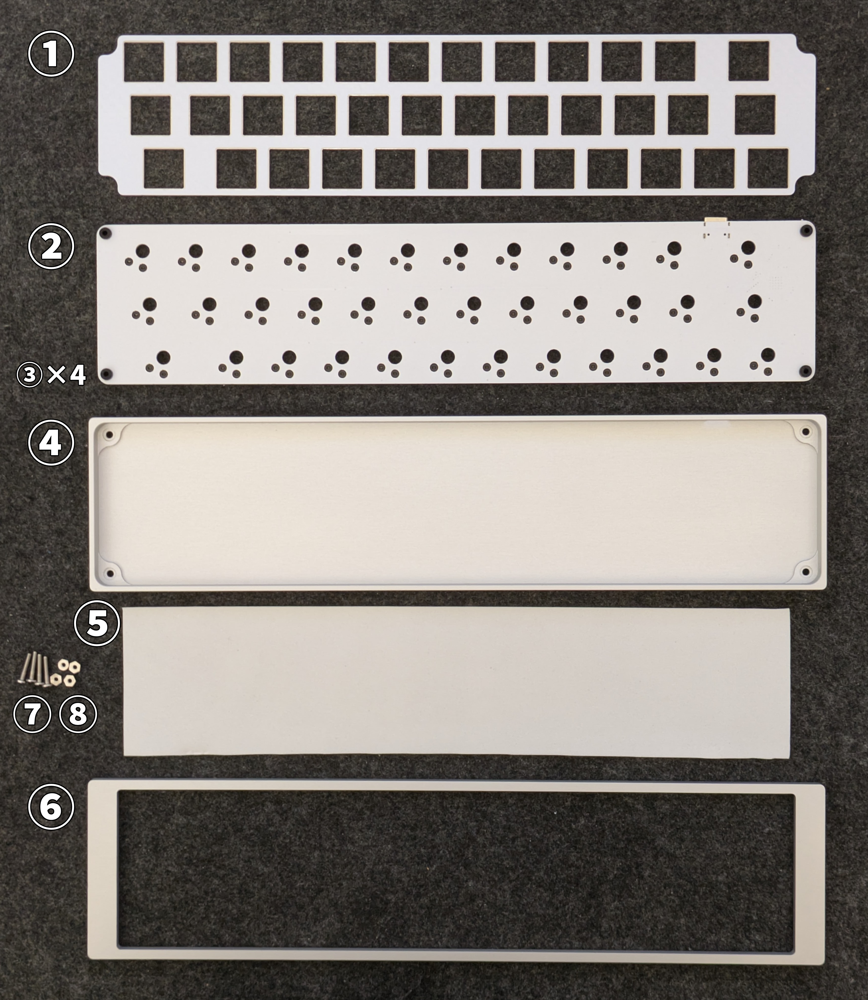

### 2.2 別途用意が必要な部品

下記は本キットに含まれません。国内外の自作キーボード専門店や電子部品販売店などから別途調達してください。

|品目|数量|備考|
|---|---|---|
|Kailh Choc V2 Full POM互換キースイッチ|36|Lofree Flow向けとして知られる5ピン仕様のものに対応します。初期の6ピンChoc V2スイッチとは仕様が異なるため互換性はありません。|
|Cherry MX互換キーキャップ|必要数|上記スイッチで利用可能なもの。フルプロファイル向けのキーは押下時に干渉することが多いため、ロープロファイル向けのものをお勧めします。|
|ゴム足等の滑り止め|任意|ゴム足なしでも利用可能ですが、お好みに応じて追加してください|

### 2.3 適合するキーキャップサイズ

下記の通りのキーキャップが必要です。

|サイズ|数量|
|---|---|
|1u|32|
|1.25u|1|
|1.5u|1|
|1.75u|2|

## 3. 組み立て

### 3.1 スイッチとキーキャップの取り付け

基板のオモテ面の上にスイッチプレートを重ね、基板のスイッチ取り付け位置とスイッチプレートの穴が一致していることを確認してください。

スイッチプレートの上からキースイッチを取り付けます。

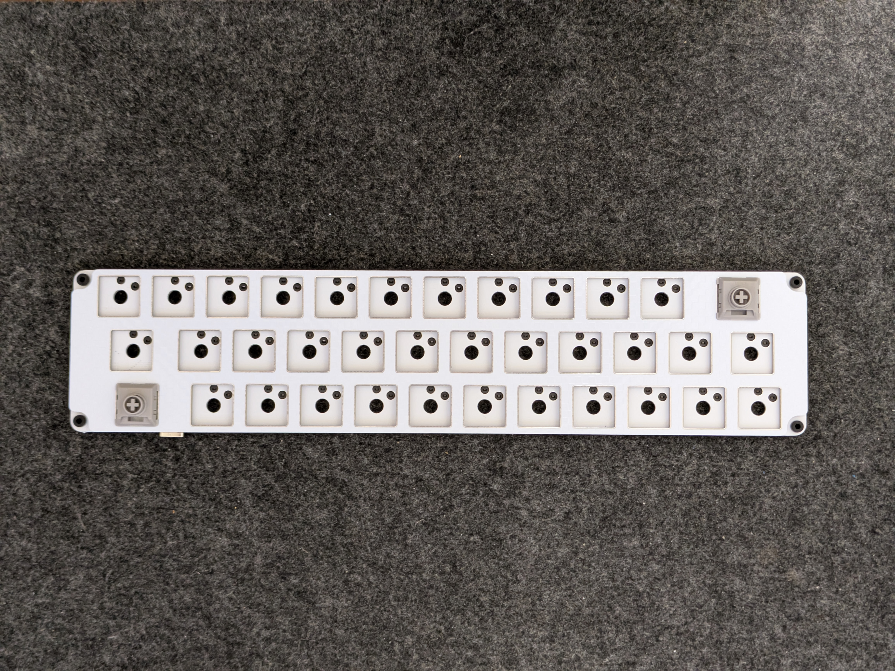

基盤とスイッチプレートの間は1mm程度隙間が空くのが正しい状態です。

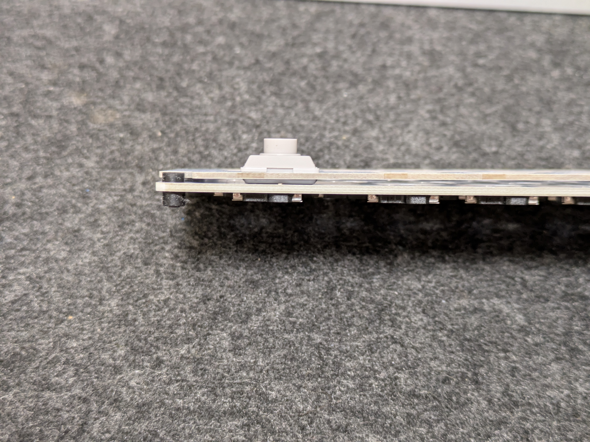

スイッチプレートの穴の横方向に若干の余裕を持たせている関係で基板に挿す前だとスイッチの固定が甘く感じるかと思いますが、基板に挿せばしっかり固定されます。

### 3.2 絶縁シートの取り付け（※アルミケースのみ）

絶縁シートをアルミケースに乗せます。

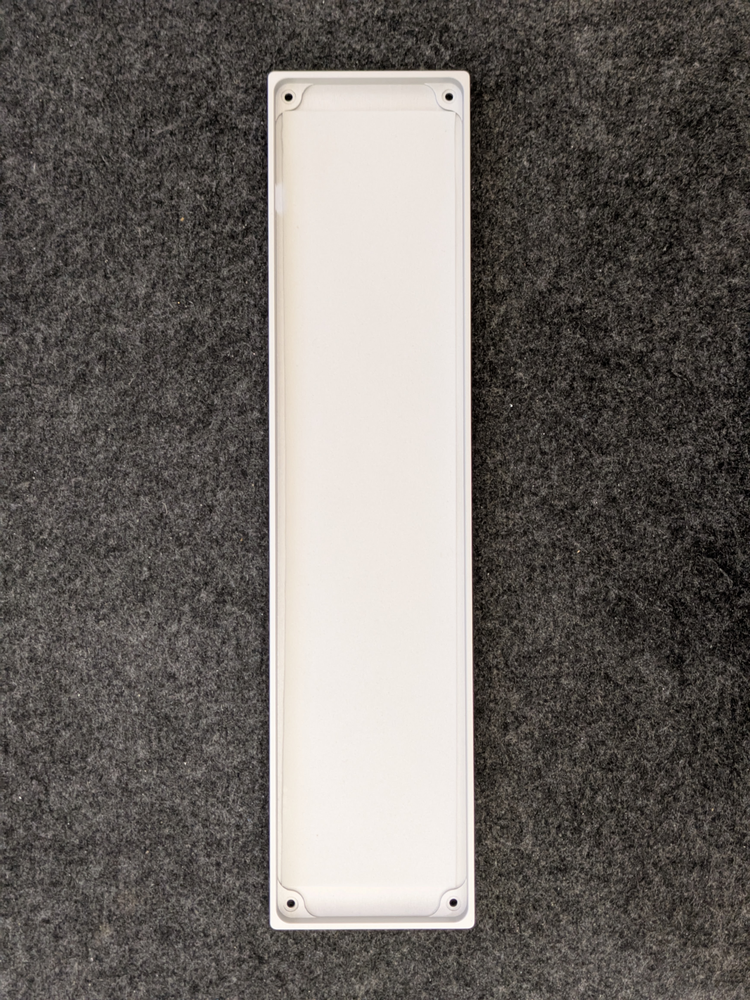

### 3.3 基板の取り付け

スイッチとキーキャップを取り付けた基板をケースに乗せます。USBコネクタをケースの穴に通してから、基板四隅のシリコンゴムがケースの四隅のくぼみに乗るようにします。

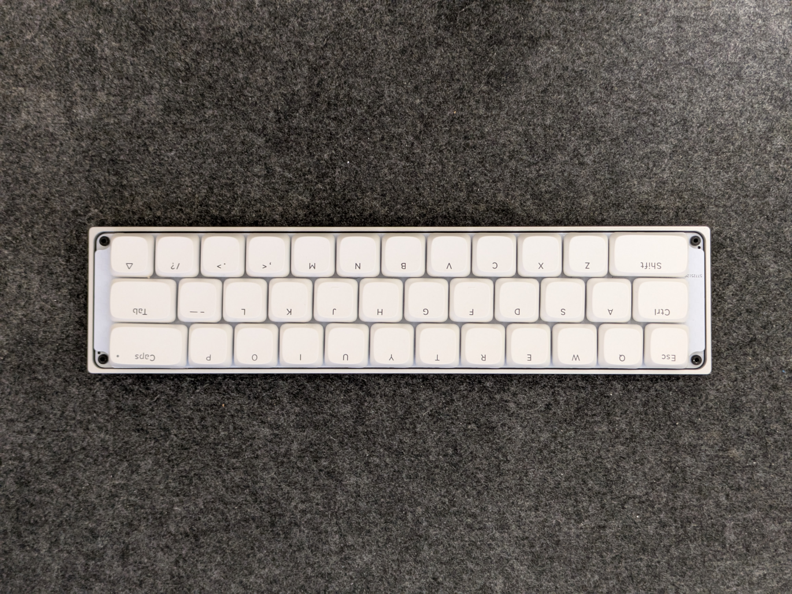

### 3.4-A ネジ留め（カバー無しの場合）

※カバー有りの場合は3.4-Bへ進んでください。

ケース底面のネジ穴からネジを通します。ネジが基板四隅のシリコンゴムの中央の穴をちょうど通るようになっています。

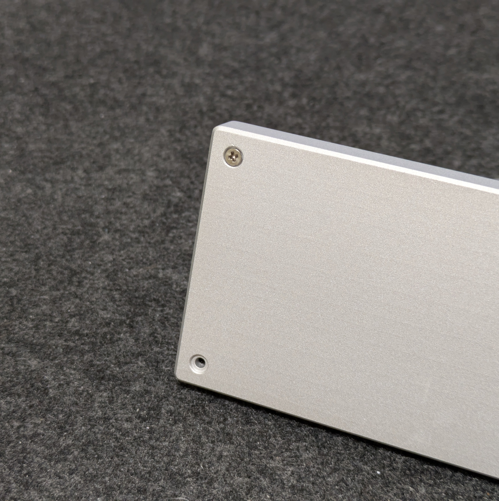

ケース上面、シリコンゴムからわずかにネジの先端が出ている状態です。ここにナットを締めます。ナットを回すのではなく、ナットを指で押さえてケース底面からネジを回すと締めやすいです。

ナットの締め付け具合で打鍵感の調整ができます。まずはネジの先端がナットからはみ出さない程度の締め具合から始めてみてください。

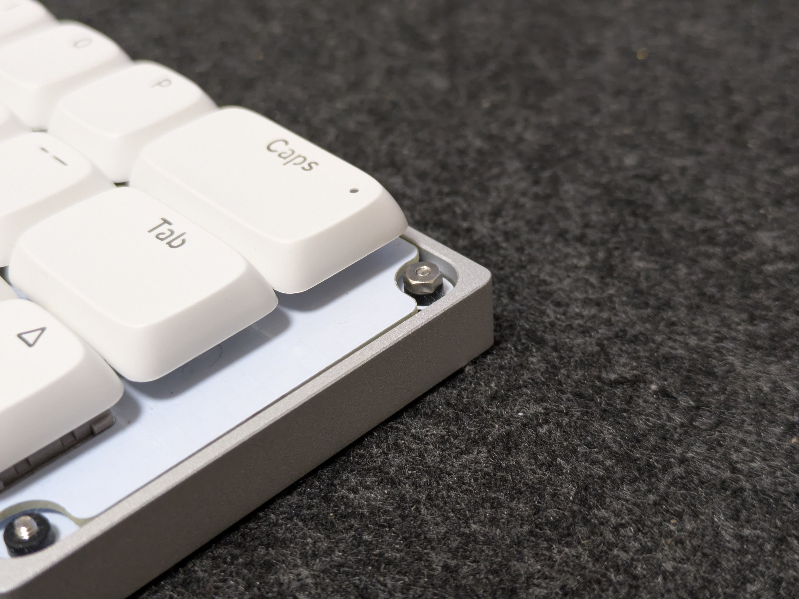

カバー無しはこれで完成です。

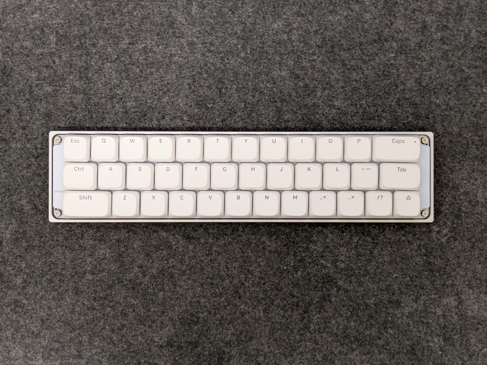

#### 3.4-B ネジ留め（カバー有りの場合）

カバーの裏面のネジ穴に直接ネジ留めします。ナットは使いません。

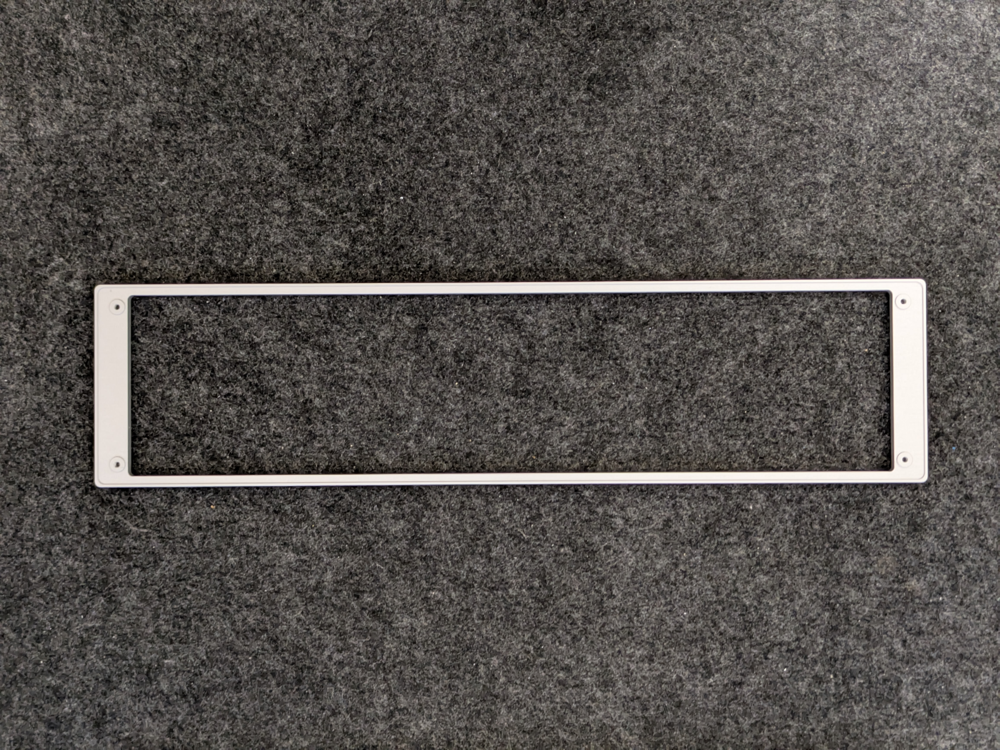

ケースの上にカバーを乗せ、ケース底面側からネジを締めてください。このときネジを強く締めすぎないように注意してください。

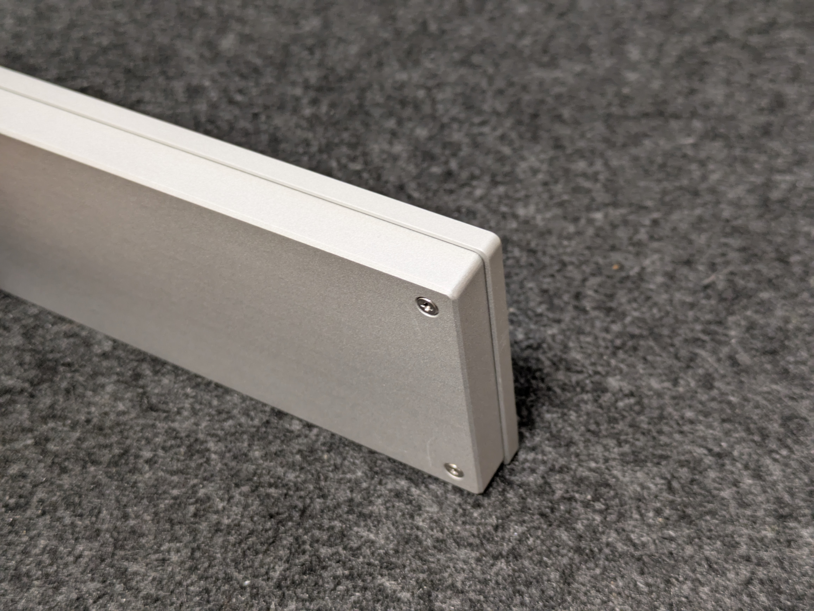

カバー付きの場合はこれで完成です。

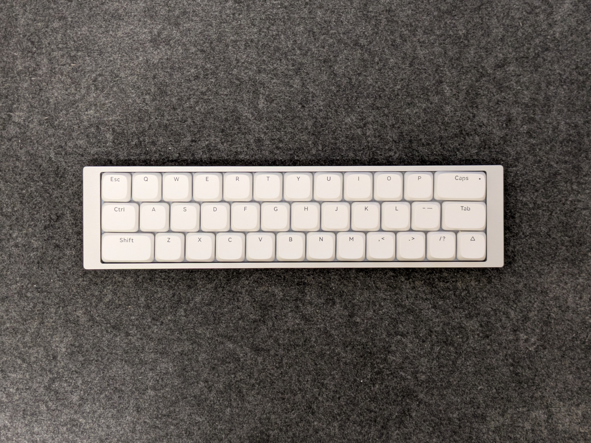

## 4. 使用

### 4.1 動作確認

コンピュータとNeigeをUSBケーブルで接続し、キーボードとして認識され、文字が入力できることを確認してください。

### 4.2 初期設定とキーマップのカスタマイズ

キーマップのカスタマイズは[Vial](https://get.vial.today/)にて行えます。

初期キーマップで使う場合は下記からキーマップ定義をダウンロードし、**インストール版**のVialにて`File > Load saved layout`から読み込んでください。これによりTapDanceの定義やQMK Settingsが復元され、作者の想定の通りに動作するようになります。

[https://github.com/ymkn/neige/releases/download/v1.0/neige.vil](https://github.com/ymkn/neige/releases/download/v1.0/neige.vil)

下記記事で初期キーマップの解説をしています。30%が初めての人はご一読されることをお勧めします。

[続・自作キーボードのキーの減らしかた（3行30%編）](https://ymkn.hatenablog.com/entry/2025/07/12/184336)

皆様のベストなキーマップへの一助になれば幸いです。

## 5. その他

### 5.1 ファームウェアの書き込み方

※トラブル時など、必要がある場合のみ行ってください。

[ファームウェアの書き込み方（STM32搭載キーボード用）](./firmware-stm.html)

Neigeの初期ファームウェアは下記にあります。

[ファームウェアのダウンロード](https://github.com/ymkn/neige/releases/download/v0.1/ymkn_neige_vial.uf2)
