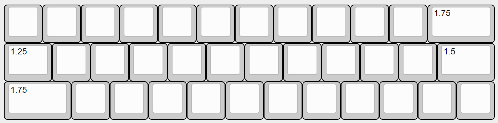

## 1. 本書について

本書は自作キーボードキットneige（ネージュ）のビルドガイドです。

## 2. 準備

### 2.1 内容物の確認

|番号|品目|数量|備考|
|----|----|----|----|
|1|neige スイッチプレート|1枚||
|2|neige メイン基板|1枚||
|3|マウント用シリコンゴム|4個|基盤に取付済|
|4|neige ケース|1個||
|5|絶縁シート (オプション)|1個|アルミケースにのみ付属|
|6|neige カバー (オプション)|1個|カバー購入時のみ|
|7|M2ネジ 10mm|4個||
|8|M2ナット|4個||

### 2.2 別途用意が必要な部品

下記は本キットに含まれません。国内外の自作キーボード専門店や電子部品販売店などから別途調達してください。

|品目|数量|備考|
|---|---|---|
|Kailh Choc V2 Full POM互換キースイッチ|36|Lofree Flow向けとして知られる5ピン仕様のものに対応します。初期の6ピンChoc V2スイッチとは仕様が異なるため互換性はありません。|
|Cherry MX互換キーキャップ|必要数|上記スイッチで利用可能なもの。フルプロファイル向けのキーは押下時に干渉することが多いため、ロープロファイル向けのものをお勧めします。|
|ゴム足等の滑り止め|任意|ゴム足なしでも利用可能ですが、お好みに応じて追加してください|

### 2.3 適合するキーキャップサイズ

下記の通りのキーキャップが必要です。

|サイズ|数量|
|---|---|
|1u|32|
|1.25u|1|
|1.5u|1|
|1.75u|2|

## 3. 組み立て

### 3.1 スイッチとキーキャップの取り付け

基板のオモテ面の上にスイッチプレートを重ね、基板のスイッチ取り付け位置とスイッチプレートの穴が一致していることを確認してください。

スイッチプレートの上からキースイッチを取り付けます。

基盤とスイッチプレートの間は1mm程度隙間が空くのが正しい状態です。

スイッチプレートの穴の横方向に若干の余裕を持たせている関係で基板に挿す前だとスイッチの固定が甘く感じるかと思いますが、基板に挿せばしっかり固定されます。

### 3.2 絶縁シートの取り付け（※アルミケースのみ）

絶縁シートをアルミケースに乗せます。

### 3.3 基板の取り付け

スイッチとキーキャップを取り付けた基板をケースに乗せます。USBコネクタをケースの穴に通してから、基板四隅のシリコンゴムがケースの四隅のくぼみに乗るようにします。

### 3.4-A ネジ留め（カバー無しの場合）

※カバー有りの場合は3.4-Bへ進んでください。

ケース底面のネジ穴からネジを通します。ネジが基板四隅のシリコンゴムの中央の穴をちょうど通るようになっています。

ケース上面、シリコンゴムからわずかにネジの先端が出ている状態です。ここにナットを締めます。ナットを回すのではなく、ナットを指で押さえてケース底面からネジを回すと締めやすいです。

ナットの締め付け具合で打鍵感の調整ができます。まずはネジの先端がナットからはみ出さない程度の締め具合から始めてみてください。

カバー無しはこれで完成です。

#### 3.4-B ネジ留め（カバー有りの場合）

カバーの裏面のネジ穴に直接ネジ留めします。ナットは使いません。

ケースの上にカバーを乗せ、ケース底面側からネジを締めてください。このときネジを強く締めすぎないように注意してください。

カバー付きの場合はこれで完成です。

## 4. 使用

### 4.1 動作確認

コンピュータとneigeをUSBケーブルで接続し、キーボードとして認識され、文字が入力できることを確認してください。

初期キーマップは下記のとおりです。

- 短押しで各キー左上に記載の文字が、長押しで各キーの右下に記載の文字が打てます
- Cキー長押ししながら打つと赤色で記載の文字が、Mキー長押ししながらだと青色で記載の文字が打てます

### 4.2 キーマップのカスタマイズ

キーマップのカスタマイズと設定は[Vial](https://get.vial.today/)というツールで行えます。直感的な画面のため、ある程度は触って理解できるかと思います。詳しい使いかたは各自お調べください。

また、下記記事で作者のキーマップ解説をしています。カスタマイズの参考になるかもしれません。

[続・自作キーボードのキーの減らしかた（3行30%編）](https://ymkn.hatenablog.com/entry/2025/07/12/184336)

### 4.3 キーボードの設定（Tap-Hold）

Vialではキーマップ変更のほか、非常に多くの設定が行えます。ここではneigeの使い勝手に関わるTap-Holdの設定項目をいくつか紹介します。

特にPermissive Holdという設定はOnにすることを強く推奨します。長押しが効きにくいと感じる人はこれだけでもぜひ設定してみてください。

Tap-Holdの設定は、Vial画面上部の`QMK Settings > Tap-Hold`にあります。

#### Tapping Term

長押しが割り当てられているキーを押したとき、長押しと判定されるまでの時間（ミリ秒）です。

長押ししたつもりが短押しになってしまうことが多い場合は、この時間を短くしてみてください。ただし、次に紹介するPermissive HoldをOnにすると大抵のケースで解消するので、Tapping Termの調整はPermissive Holdを試してからの方がよいかと思います。

#### Permissive Hold

初期状態ではOffですが、**On推奨**です。

この設定をOnにすると、長押しが割り当てられている1つ目のキーを押しながら、2つ目のキーを押して離したときに、Tapping Termに関わらず常に1つ目のキーが長押しとして扱われるようになります。

つまり単独の長押しの判定は遅めにしたいが、Ctrlやレイヤー切替など他のキーとの組み合わせる場合は即時長押しとさせたい、というときに使います。

初期キーマップで言うとCキー/Mキー（長押しレイヤー切替）や、Xキー（長押しAlt）、Spaceキー（長押しCtrl）などの動作で体感しやすいかと思います。

#### Hold On Other Key Press

Permissive Holdの強化版設定です。2つ目のキーが押された瞬間（離す前）に1つ目のキーが長押し判定されます。

1つ目のキーを早めに離してしまう癖がある場合に有効ですが、打鍵速度が速い場合は逆に誤打鍵が増えてしまう可能性があります。

### 4.4 設定の初期化

下記から初期設定ファイルをダウンロードし、**インストールアプリ版**のVial（v0.7.4以降）にて`File > Load saved layout`から読み込んでください。

[https://github.com/ymkn/neige/releases/download/v1.0/ymkn_neige_default.vil](https://github.com/ymkn/neige/releases/download/v1.0/ymkn_neige_default.vil)

## 5. その他

### 5.1 ファームウェアの書き込み方

※トラブル時など、必要がある場合のみ行ってください。

[ファームウェアの書き込み方（STM32搭載キーボード用）](./firmware-stm.html)

neigeの初期ファームウェアは下記にあります。

[https://github.com/ymkn/neige/releases/download/v1.0/ymkn_neige_vial.bin](https://github.com/ymkn/neige/releases/download/v1.0/ymkn_neige_vial.bin)

