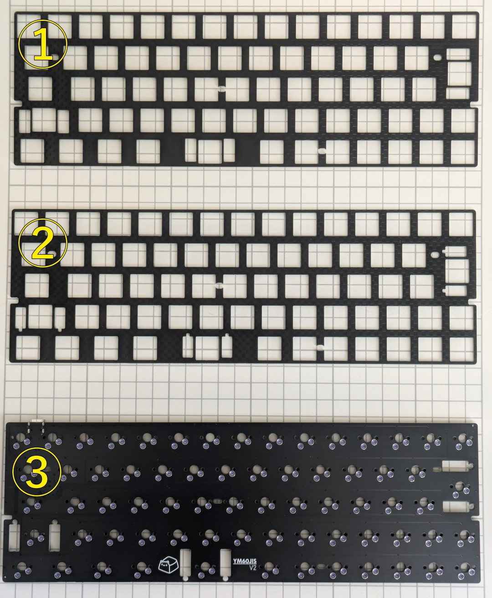
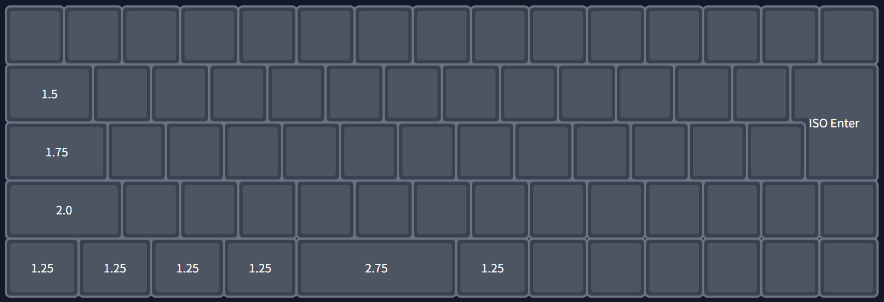
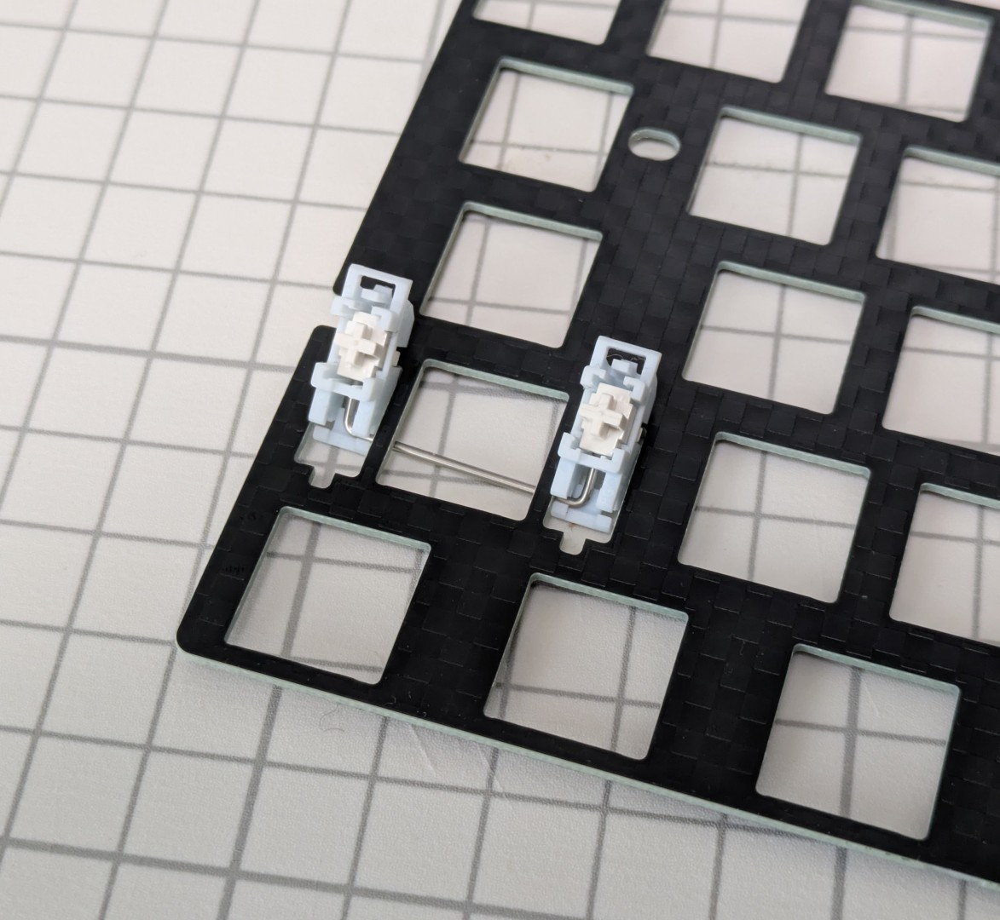
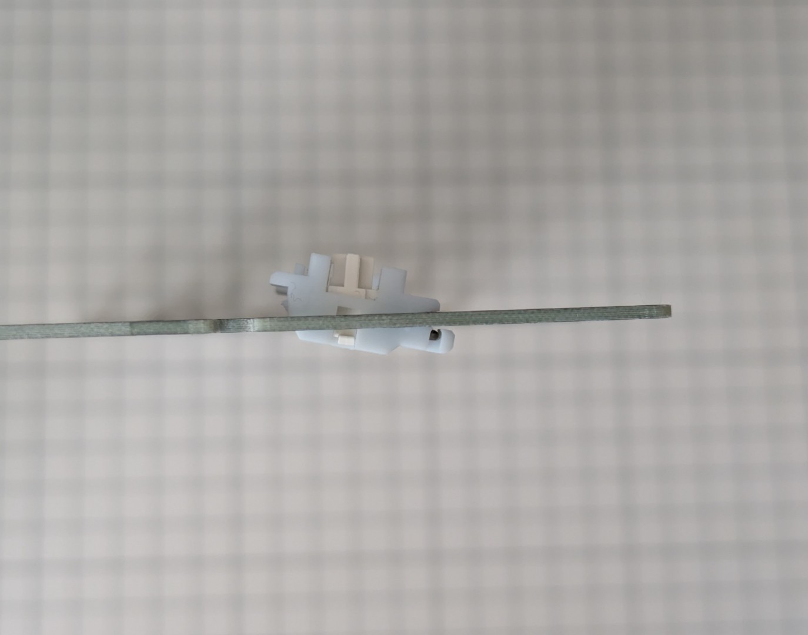
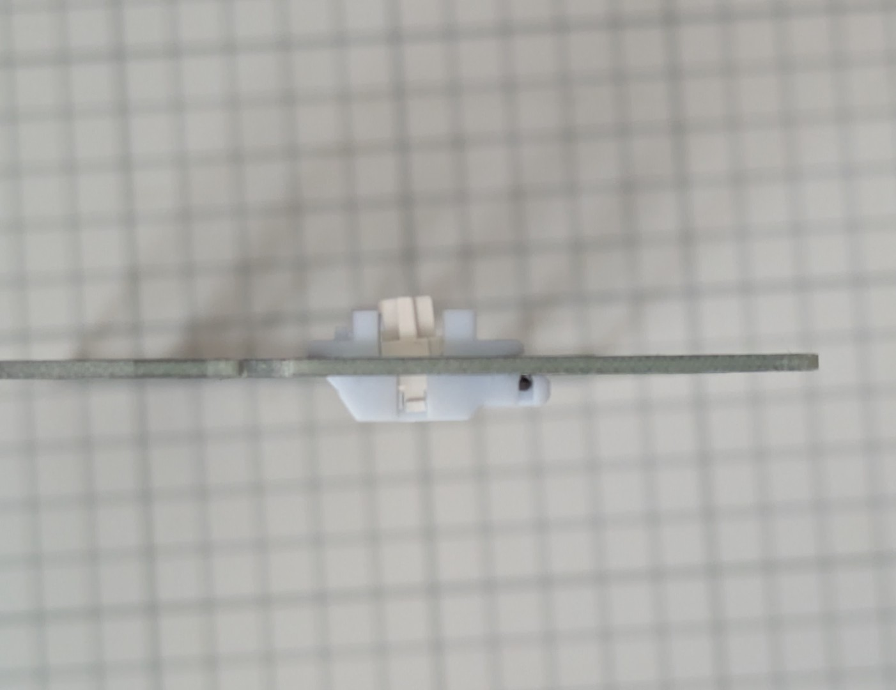
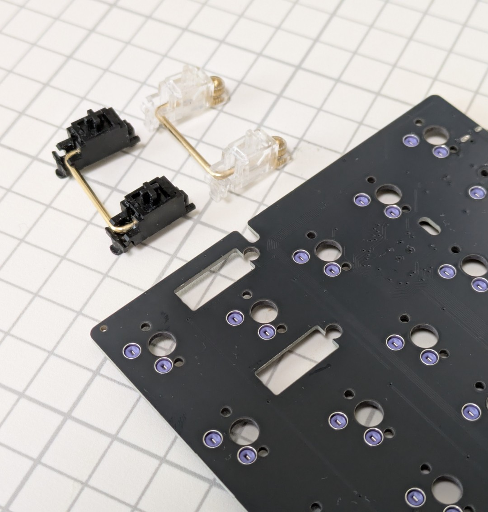
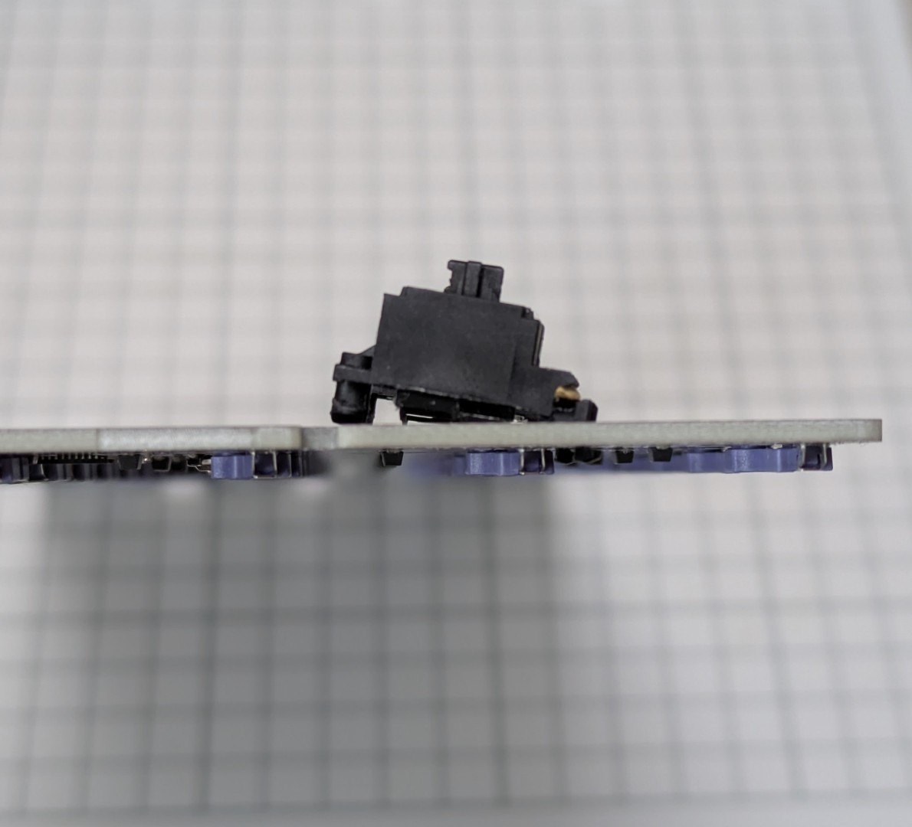
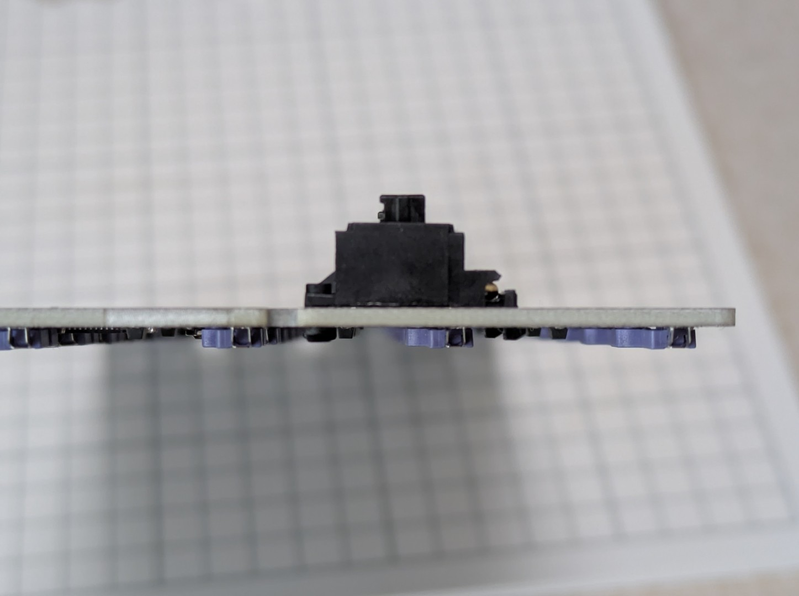
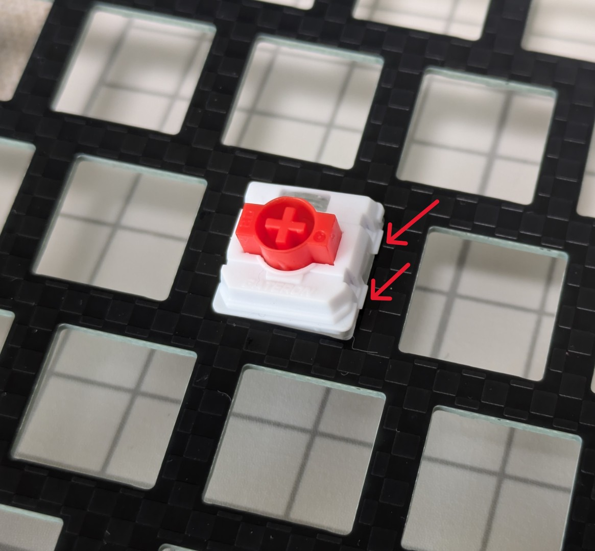
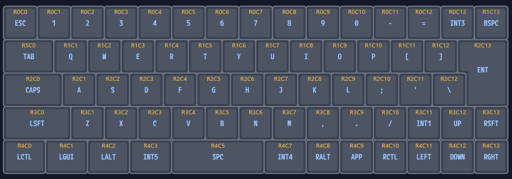

## 1. 本書について

本書は自作キーボードキットYM60JISv2のビルドガイドです。

## 2. 準備

### 2.1 内容物の確認

|番号|品目|数量|備考|
|----|----|----|----|
|1|YM60JISv2 スイッチプレート (ハイプロファイル用)|1枚|1.6mm厚|
|2|YM60JISv2 スイッチプレート (ロープロファイル用)|1枚|1.2mm厚|
|3|YM60JISv2 メイン基板（PCB）|1枚||

### 2.2 別途用意が必要な部品（ロープロファイルで作成する場合）

下記は本キットに含まれません。国内外の自作キーボード専門店や電子部品販売店などから別途調達してください。

|品目|数量|備考|
|---|---|---|
|Gateron Low Profile 3.0互換キースイッチ|68|Nuphy社の最新ロープロファイルキーボードで用いられている規格のスイッチのみに対応します|
|Gateron Low Profile Plate Mount Stabilizer (2Uサイズ)|3|Gateron社が販売するロープロファイル向けのプレートマウントスタビライザーのみに対応します|
|Cherry MX互換キーキャップ|必要数|PFFプロファイルなどのロープロファイル向けキーキャップの利用を推奨します|
|Poker互換60%サイズキーボードケース|1|Poker互換、60%、GH60対応品、などと称して販売されているトレイマウント型のケースが利用できます（※すべてのケースで完全な互換性を保証するものではありません）|

#### 2.2.1 Gateron Low Profile 3.0スイッチについて

2026年5月現在、流通しているGateron Low Profile 3.0スイッチは下記のみです。これ以外のロープロファイルスイッチは使用できません。

- [Red(リニア), Brown(タクタイル)](https://www.gateron.com/products/gateron-ks-33-low-profile-30-mechanical-switch?VariantsId=11401)
- [Grey Heron(リニア)](https://www.gateron.com/products/gateron-low-profile-grey-heron-switch?VariantsId=10866)
- [Silver(リニア軽量), Blush(リニア静音)](https://nuphy.com/products/gateron-low-profile-3-0-switches)
- [Panda nano(タクタイル)](https://sanyollc.com/products/panda-nano-switches)

Gateron公式のほか、Amazon、Nuphy（日本ではDIGIART）などから購入できます。

- ※沢山の種類が出ているGateron Low Profile **2.0** とは互換性が無く、使用できません。3.0と見た目が非常に似ておりかつシリーズ型番も「KS-33」で同じであるため極めて紛らわしいです。誤って購入しないようご注意ください
- ※Lofree製キーボードや多くのロープロファイル自作キーボードで採用されているKailh Chocとは互換性が無く、使用できません

#### 2.2.2 スタビライザーについて

左Shiftキー、スペースキー、Enterキー用にそれぞれ2Uサイズが必要です。Gateronから発売されている[Gateron Low Profile Plate Mount Stabilizer](https://www.gateron.com/products/gateron-low-profile-plate-mounted-stabilizer)もしくは[Gateron Low Profile Sky Plate Mount Stabilizer](https://www.gateron.com/products/gateron-low-profile-sky-plate-mounted-stabilizer)（色違い）のみが利用可能です。AmazonのGateron公式ストアから購入可能です。

- ※Gateron Low Profile Plate Mount Stablizerは、Gateron Low Profile 2.0と3.0両方に互換性があります。販売サイトによっては3.0への対応の記載がないことがありますが、問題ありません
- ※Lofree製キーボードで採用されているKailh Choc用プレートスタビライザーは使用できません

### 2.3 別途用意が必要な部品（ハイプロファイルファイルで作成する場合）

下記は本キットに含まれません。国内外の自作キーボード専門店や電子部品販売店などから別途調達してください。

|品目|数量|備考|
|---|---|---|
|MX互換キースイッチ|68|Cherry MXもしくはその互換品|
|MX互換キーキャップ|必要数|Cherry MXもしくはその互換品|
|2uサイズPCBマウント型スタビライザー|3|幅の広いキーの押し下げを安定させる部品です。左Shiftキー、スペースキー、Enterキーに用います。（※ロープロファイル向けやプレートマウント型は使用できませんので間違えないように注意ください）|
|Poker互換60%サイズキーボードケース|1|Poker互換、60%、GH60対応品、などと称して販売されているトレイマウント型のケースが利用できます（※すべてのケースで完全な互換性を保証するものではありません）|

### 2.4 適合するキーキャップサイズ

下記の通りのキーキャップが必要です。

|サイズ|数量|
|---|---|
|1u|58|
|1.25u|5|
|1.5u|1|
|1.75u|1|
|2u|1|
|2.75u|1|
|ISO Enter|1|

フルプロファイル向けのキーキャップセットは選択肢が多く存在しますが、ロープロファイル用のキーキャップセットは限られており、2026年5月時点では下記のみです。

- [JezailFunder製LAKキーキャップのバラ売り](https://jezailfunder.jp/products/lak-blank)の方で揃える
- その他、Group BuyなどでPFFプロファイルのキーキャップセットを入手する

また、既製品で日本語配列向けの印字があり、かつYM60JISv2に適合するキーキャップは殆ど存在しません（※）。印字が重要な場合は、[Yuzu Custom Keycap](https://yuzukeycaps.com/ja)で自分で指定したものをオーダーするのが確実です。

※ [Acid Capsシリーズ](https://keeb-on.com/collections/acid-caps)が日本語配列向けの唯一の選択肢です。但し、ロープロファイル向けのセットにはスペースキー（2.75u）が含まれないため、Shiftキーで代用となります

## 3. 組み立て

※組み立てを始める前に、基板ウラ面の部品の状態がわかるような写真を撮影しておくことをお勧めします。初期不良で問い合わせる際の説明に役立ちます。

### 3.1 スタビライザーの取り付け

#### 3.1.1 ロープロファイル向けの場合

プレートの切り欠きがある方にワイヤーが来るようにスタビライザーの向きを揃え、プレートのウラ面からスタビライザーの足をオモテ面に通します。

ワイヤーがある側の足をプレートのくぼみに引っ掛けます。

もう片方の足をプレートオモテ面から押し込めば取り付け完了です。

#### 3.1.2 ハイプロファイル向けの場合

PCBの丸い切り欠きのある方にプッシュピン側が来るように、スタビライザーの向きを揃えます。

ワイヤー側の爪を基板ウラ面に引っ掛けます。

プッシュピン側を丸い穴に押し込みます。ネジ止めの場合は基板ウラ面からネジを締めてください。

### 3.2 スイッチとキーキャップの取り付け

基板のオモテ面の上にスイッチプレートを重ね、基板のスイッチ取り付け位置とスイッチプレートの穴が一致していることを確認してください。

そして、スイッチプレートの上からキースイッチを取り付けます。プレートと基板の間はある程度の隙間が空いた状態が正常です（ハイプロファイルで約3.5mm、ロープロファイルで約1mm）。

> [!Warning]
> 取り付けの際はスイッチのピンが曲がらないように優しく差し込んでください。ピンが曲がった状態で力をかけてしまうと、曲がったピンでソケットが押されて基板の部品剥がれに繋がります。組立時の破損は保証対象外となりますので注意してください。

Gateron Low Profile 3.0スイッチは爪が大きく、硬い素材のプレートにハマりにくいことがあります。このような場合はピンセットなどでスイッチの爪を押しながら押し込むと入れやすいです。

## 4. 使用

### 4.1 動作確認

コンピュータとYM60JISv2をUSBケーブルで接続し、キーボードとして認識され、文字が入力できることを確認してください。

初期キーマップは下記のとおりです。

### 4.2 キーマップのカスタマイズ

キーマップのカスタマイズと設定は[Vial](https://get.vial.today/)というツールで行えます。直感的な画面のため、ある程度は触って理解できるかと思います。詳しい使いかたは各自お調べください。

## 5. その他

### 5.1 ファームウェアの書き込み方

※トラブル時など、必要がある場合のみ行ってください。

[ファームウェアの書き込み方（STM32搭載キーボード用）](./firmware-stm.html)

YM60JISv2の初期ファームウェアは下記にあります。

[GitHubからダウンロード](https://github.com/ymkn/YM60JISv2/releases/latest/download/ymkn_ym60jisv2_vial.bin)

## 6. 故障かなと思ったら

下記ページを参照してご確認ください。

[故障かなと思ったら](./troubleshoot.html)

初期不良と思われる場合は[サポートポリシー](https://ymkn.github.io/1u-nekokey/support/)ご参照のうえお問い合わせください。

